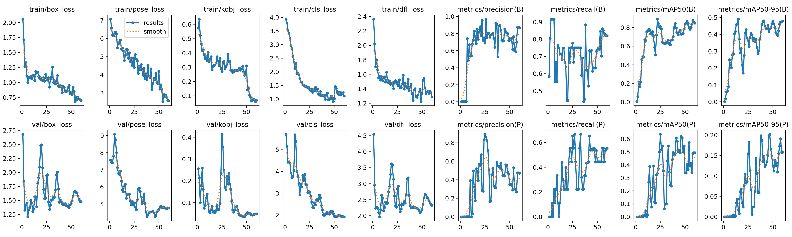
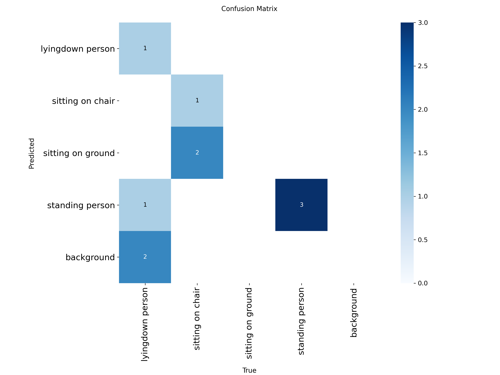
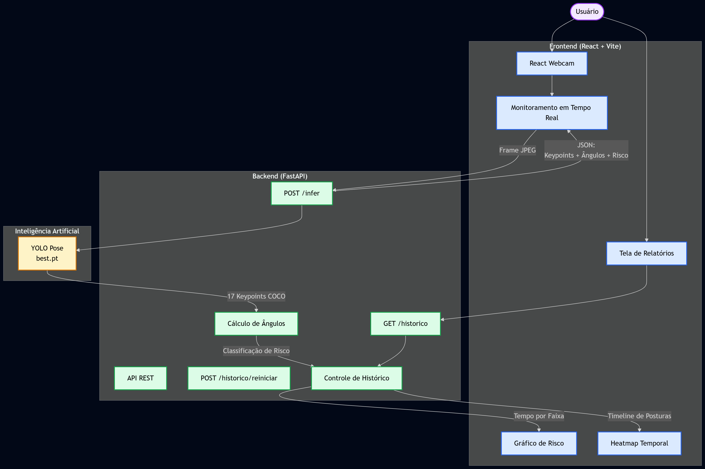

# Sistema de Análise Ergonômica com YOLO Pose

## Descrição

Sistema web para análise ergonômica em tempo real utilizando Visão Computacional e Inteligência Artificial. A aplicação detecta a postura do usuário por meio de uma webcam, calcula ângulos corporais relevantes, classifica o risco ergonômico e gera relatórios contendo o tempo gasto em cada faixa de risco e um heatmap temporal das posturas.

---

# Integrantes da Equipe

| Nome completo | 
|---|
| Diego Dantas Domingues |
| Heitor Marques Magalhães |
| João Pedro Ribeiro Lourenço |
| José Marcio Silva Pinho |
| Marcos Vinicius Cardoso de Araújo |

---

# Tema do Projeto

**Análise Ergonômica e Prevenção de Lesões Ocupacionais**

O projeto utiliza a tarefa de **Pose Estimation (Estimativa de Pose Humana)** da arquitetura YOLO para identificar pontos-chave do corpo humano (keypoints) e avaliar automaticamente a postura do usuário durante atividades em frente ao computador.

---

# Modelo Utilizado

### Modelo Base

YOLO Pose

Modelo utilizado:

`yolo11n-pose.pt`


### Justificativa

O modelo foi escolhido por apresentar:

* Inferência em tempo real;
* Boa precisão na detecção de keypoints corporais;
* Facilidade de integração com aplicações web;
* Baixo custo computacional para execução em computadores comuns.

---

# Dataset

### Origem

Dataset personalizado criado para análise ergonômica apartir de um dataset base.

Dataset Base:

https://universe.roboflow.com/industry-ecruv/human-pose-estimation-sample

Projeto Personalizado Roboflow:

https://app.roboflow.com/diego-dantas/human-pose-estimation-sample-p4klp/1

### Ferramenta de Anotação

Roboflow

### Quantidade de Imagens

| Conjunto  | Quantidade |
| --------- | ---------- |
| Treino    | 53  |
| Validação | 9 |
| Teste     | 4 |
| Total     | 66  |

### Classes

Como se trata de Pose Estimation, o dataset utiliza keypoints corporais do padrão COCO:

* Nariz
* Olhos
* Orelhas
* Ombros
* Cotovelos
* Punhos
* Quadris
* Joelhos
* Tornozelos

Total de 17 keypoints.

### Divisão dos Dados

| Conjunto  | Percentual |
| --------- | ---------- |
| Treino    | 80.30% |
| Validação | 13.64% |
| Teste     | 6.06% |

---

# Treinamento

### Configuração

* Framework: Ultralytics YOLO
* Linguagem: Python
* Plataforma: Google Colab
* GPU: GPU T4

### Principais Métricas

| Métrica   | Valor     |
| --------- | --------- |
| Box |  |
| mAP50     | 0.878 |
| mAP50-95  | 0.474 |
| Precision | 0.877 |
| Recall    | 0.823 |
| Pose | |
| mAP50     | 0.489 |
| mAP50-95  | 0.191 |
| Precision | 0.474 |
| Recall    | 0.539 |


### Link do Notebook GoogleColab

https://colab.research.google.com/drive/1mOGpuo5tHSPp4z93L-lYDwBT4Q6Wpqkg#scrollTo=eafcff79


---
# Resultados do Treino

## Curva de Treinamento




---

## Matriz de Confusão



---

# Arquitetura da Aplicação

A aplicação segue uma arquitetura cliente-servidor:

```text
Frontend (React + Vite)
            │
            ▼
Backend (FastAPI)
            │
            ▼
YOLO Pose (Modelo Treinado)
            │
            ▼
Análise Ergonômica
```

## Diagrama



---

# Funcionalidades

## Monitoramento em Tempo Real

* Captura de vídeo pela webcam;
* Processamento de frames em tempo real;
* Detecção de keypoints corporais;
* Desenho do esqueleto humano;
* Cálculo dos ângulos corporais;
* Classificação do risco ergonômico.

## Relatórios

* Tempo em postura adequada;
* Tempo em postura de atenção;
* Tempo em postura crítica;
* Quantidade de frames processados;
* Heatmap temporal das posturas.

---

# Regras de Avaliação Ergonômica

O sistema calcula ângulos utilizando os keypoints detectados pelo YOLO Pose.

Atualmente são avaliados:

* Tronco
* Pescoço

Classificações:

| Faixa    | Significado           |
| -------- | --------------------- |
| Adequado | Postura correta       |
| Atenção  | Necessita correção    |
| Crítico  | Alto risco ergonômico |

---

# Tecnologias Utilizadas

## Backend

* Python
* FastAPI
* Uvicorn
* OpenCV
* NumPy
* Ultralytics YOLO
* Pydantic

## Frontend

* React
* Vite
* React Bootstrap
* React Webcam
* Recharts

## Treinamento

* Google Colab
* Roboflow
* Ultralytics YOLO

---

# API

## Base URL

```text
http://localhost:8000
```

## Endpoints

| Rota                 | Método | Entrada                    | Saída                                      |
| -------------------- | ------ | -------------------------- | ------------------------------------------ |
| /health              | GET    | —                          | Status da API                              |
| /infer               | POST   | Imagem multipart/form-data | Keypoints, ângulos, risco e imagem anotada |
| /historico           | GET    | —                          | Histórico acumulado da sessão              |
| /historico/reiniciar | POST   | —                          | Reinicia o histórico                       |

---

## Exemplo de Resposta (/infer)

```json
{
  "pessoa_detectada": true,
  "risco_geral": "adequado",
  "angulos": {
    "tronco": {
      "valor": 12.3,
      "classificacao": "adequado"
    }
  }
}
```

---

# Instalação

## Backend

```bash
cd backend

python -m venv venv

# Linux/Mac
source venv/bin/activate

# Windows
venv\Scripts\activate

pip install -r requirements.txt
```

### Modelo Treinado

Colocar o arquivo:

```text
models/best.pt
```

Caso deseje utilizar outro caminho:

```bash
export MODEL_PATH=/caminho/para/best.pt
```

### Executar Backend

```bash
uvicorn app.main:app --reload --port 8000
```

Swagger:

```text
http://localhost:8000/docs
```

---

## Frontend

```bash
cd frontend

npm install

npm run dev
```

Aplicação:

```text
http://localhost:5173
```

---

# Pesos Treinados

Arquivo:

```text
backend/model/best.pt
```

---

# Estrutura do Projeto

```text
projeto/
│
├── backend/
│   ├── app/
│   ├── models/
│   └── requirements.txt
│
├── frontend/
│   ├── src/
│   ├── public/
│   └── package.json
│
├── docs/
│   ├── arquitetura.png
│   ├── results.png
│   └── confusion_matrix.png
│
└── README.md
```

---

# Licença

Projeto desenvolvido para fins acadêmicos na disciplina de Inteligência Artificial / Visão Computacional.
